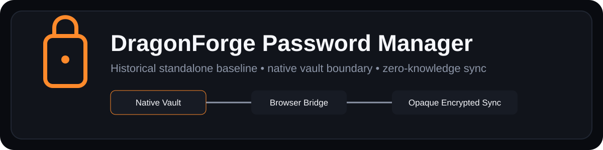
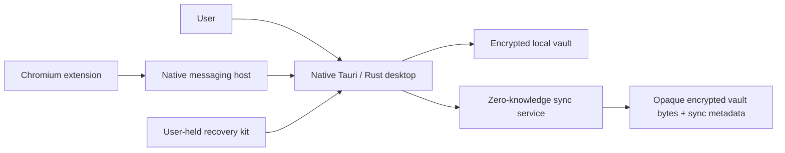

# DragonForge Password Manager

<p align="center">
  
</p>

DragonForge Password Manager is the historical standalone implementation of DragonForge's security-first, zero-knowledge password manager. It combines an encrypted local vault, Windows desktop application, Chromium browser integration, encrypted multi-device sync, device authorization, and account-recovery workflows with an emphasis on cryptographic agility.

> **Repository status:** this repository is the verified pre-migration baseline. Active Password Manager development now lives in [DragonForge Security Suite](https://github.com/djames1987/DragonForge-Security-Suite). The standalone baseline completed Phase 11 Windows credential-protection verification before migration.

The root banner is new Phase 5 first-party SVG geometry and does not reuse the pre-existing icon/product-overview artwork covered by unresolved provenance gate `DF-P3-ASSET-001`. The existing [Product Overview](docs/PRODUCT_OVERVIEW.md) remains historical documentation but is not treated here as provenance-cleared public branding.

## Security architecture

The design keeps the decrypted vault and master key in the native Rust application rather than the browser extension or sync service.

Core properties include:

- Argon2id password-based key derivation;
- AES-256-GCM authenticated encryption;
- HKDF-SHA-512 domain-separated key derivation;
- per-item random encryption keys and an encrypted vault master key hierarchy;
- zeroization-oriented secret types for sensitive key material;
- ML-KEM-768 and ML-DSA-65 experimentation for post-quantum migration paths;
- X25519 + ML-KEM hybrid key-establishment support;
- versioned encrypted formats with structural and resource-limit validation;
- encrypted backup/import and Windows-safe atomic storage updates.

The post-quantum implementation uses the RustCrypto `ml-kem` and `ml-dsa` crates rather than the older unmaintained `pqcrypto-*` bindings.

### Trust boundaries at a glance



The browser extension and sync service are not decryption authorities. See [Cryptography](docs/CRYPTOGRAPHY.md) and [Vault Format](docs/VAULT_FORMAT.md) for the detailed contracts.

## Desktop application

The Tauri 2 desktop client provides native vault creation/unlock, login and secure-note management, search, favorites, password generation, backup/integrity operations, password changes, sync controls, enrollment/recovery workflows, and Windows credential protection.

The unlocked vault session is owned by Rust. The webview receives only the data required for the active UI operation; it does not own the vault object or vault master key. Credential-bearing command inputs are handled as short-lived native command data rather than persistent browser storage.

On Windows, Phase 11 moved the sync bearer token and ML-DSA device signing seed out of the sync sidecar and into Windows Credential Manager. Version-3 Windows sidecars contain non-secret synchronization metadata plus a random credential reference.

## Browser integration

The Chromium Manifest V3 extension supports Chrome and Edge without broad permanent host permissions or persistent content scripts.

Credential filling requires an explicit user action. Site-matching searches return summaries rather than passwords; a password is requested only for the selected fill operation, and the desktop application independently rechecks site scope before release. The native messaging host bridges the extension to the running desktop application over authenticated loopback communication.

The master password, Account Secret, vault master key, and item-wrapping keys are not sent into the browser extension.

See [Browser Extension Architecture](docs/PHASE6_BROWSER.md).

## Zero-knowledge sync and recovery

The sync server stores opaque encrypted vault bytes plus the minimum account/device/revision metadata required to coordinate synchronization. It does not receive decrypted vault entries.

The sync design includes:

- optimistic revision concurrency and explicit conflict handling;
- HTTPS requirements for non-loopback deployment;
- ML-DSA device enrollment, approval, rename, and revocation;
- signed vault requests bound to method, path, timestamp, payload hash, and revision;
- offline recovery identities and user-held recovery kits;
- recovery flows that verify the master password locally before changing server trust;
- token/recovery-key rotation after successful account recovery.

The PostgreSQL-backed server and in-memory test implementation share the same protocol model. See the Phase 7–11 documents under [`docs/`](docs/) for setup and protocol details.

### Screenshots

No desktop/browser screenshot is fabricated in this phase. Genuine captures must be taken from a clean demo vault with synthetic credentials and with recovery/device secrets excluded. The exact capture set is defined in [Public Screenshot Capture](docs/PUBLIC_SCREENSHOT_CAPTURE.md).

## Quick start

On Windows, after installing the Rust toolchain plus the Microsoft C++/WebView2 prerequisites:

```powershell
cargo run -p dragonforge-desktop
```

The desktop frontend is checked-in HTML/CSS/JavaScript and does not require a Node/npm build step.

Useful source validation commands are:

```powershell
cargo fmt --all --check
cargo clippy --workspace --all-targets --all-features -- -D warnings
cargo test --workspace --all-features
cargo build -p dragonforge-desktop --release
```

Phase-specific Windows validation scripts remain under [`scripts/`](scripts/) and their corresponding documentation under [`docs/`](docs/).

## Important limitations

DragonForge Password Manager has **not undergone an independent cryptographic or application-security audit or penetration test**. This historical standalone project should not be represented as externally certified, formally verified, or independently audited.

It is also no longer the canonical development repository. New fixes and features belong in DragonForge Security Suite unless the project owner explicitly resumes standalone development here.

Remote sync requires correctly configured HTTPS/TLS termination. The zero-knowledge design reduces server exposure to vault plaintext but does not eliminate endpoint compromise, weak master passwords, compromised client devices, recovery-kit mishandling, browser compromise, or implementation defects.

Before public publication, the custom icon/documentation assets remain subject to the visual-asset provenance gate recorded in the DragonForge public-readiness program. This README does not imply that gate has been resolved.

## Documentation

- [Product Overview](docs/PRODUCT_OVERVIEW.md) — historical visual feature and architecture tour; existing artwork remains provenance-gated
- [Cryptography](docs/CRYPTOGRAPHY.md) — cryptographic primitives and key hierarchy
- [Vault Format](docs/VAULT_FORMAT.md) — encrypted storage contract
- [Desktop Architecture](docs/PHASE5_DESKTOP.md) — native/webview application boundary
- [Browser Extension](docs/PHASE6_BROWSER.md) — browser/native messaging trust model
- [Sync Server](docs/PHASE7_SYNC_SERVER.md) — zero-knowledge server foundation
- [Multi-Device Sync](docs/PHASE8_MULTI_DEVICE_SYNC.md)
- [Device Enrollment](docs/PHASE9_DEVICE_ENROLLMENT.md)
- [Account Recovery](docs/PHASE10_ACCOUNT_RECOVERY.md)
- [Windows Credential Protection](docs/PHASE11_CREDENTIAL_PROTECTION.md)
- [Public Screenshot Capture](docs/PUBLIC_SCREENSHOT_CAPTURE.md) — synthetic demo and sanitization rules
- [Security Policy](SECURITY.md)
- [Third-party notices](THIRD_PARTY_NOTICES.md)
- [`docs/`](docs/) — complete phase and validation history

The detailed phase chronology remains available in these engineering records instead of dominating the repository landing page.

## Personal / Portfolio Use Disclaimer

This repository is maintained for my personal projects, learning, evaluation, authorized security research, and portfolio demonstration. It is not intended or offered as a commercial product, managed service, professional consulting service, certification, warranty, or guarantee of fitness for any particular purpose.

Any third party who chooses to compile, run, adapt, evaluate, or otherwise use material from this repository does so entirely at their own risk and is responsible for ensuring that their use is lawful, authorized, appropriate for their environment, and compliant with applicable licenses and third-party terms.

To the maximum extent permitted by applicable law, I assume no responsibility or liability for loss, damage, data loss, service interruption, security incidents, system changes, misuse, legal or regulatory consequences, or any other outcome arising from another person's use of or reliance on this repository or its materials.

This disclaimer does not expand the permissions granted by the repository's license. The licensing terms below continue to control whether and how the material may be used.

## Licensing

Copyright © 2026 David James. All rights reserved.

Original DragonForge material in this repository is **source-visible, not open source**. It is visible for evaluation, portfolio review, security review, and reference. Except for rights expressly required by GitHub's Terms of Service for public repositories, no general permission is granted to use, copy, modify, redistribute, sublicense, sell, commercially exploit, or incorporate original DragonForge material into another work.

See [LICENSE](LICENSE). Third-party components retain rights under their own licenses; see [THIRD_PARTY_NOTICES.md](THIRD_PARTY_NOTICES.md).
